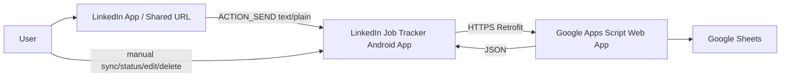
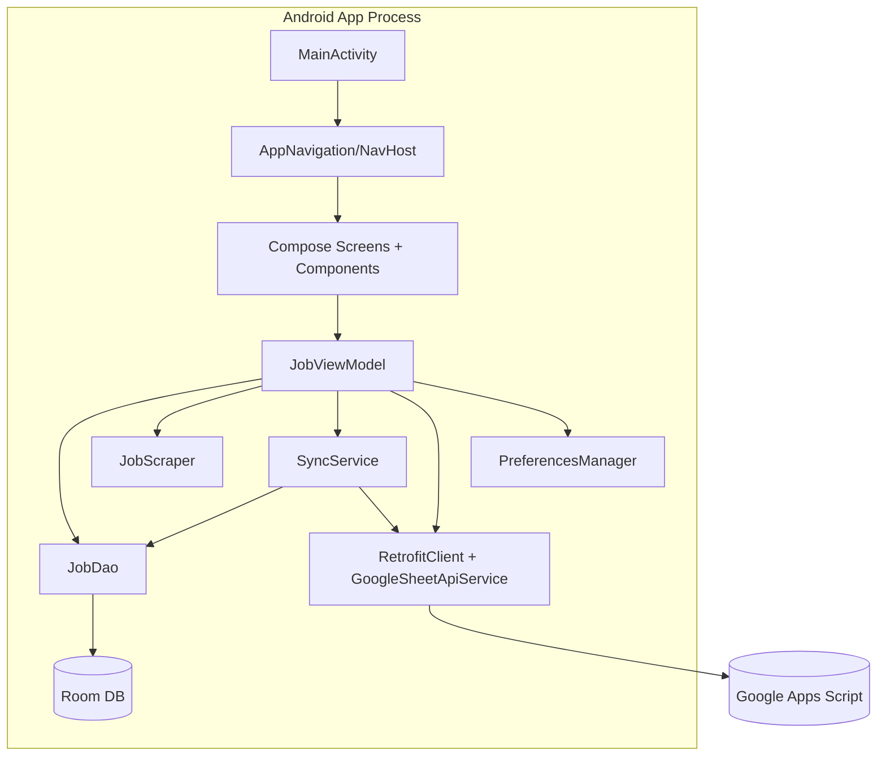
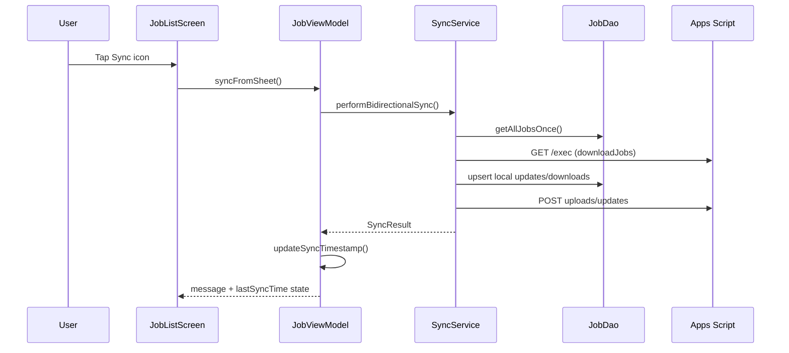

# Project Architecture Blueprint

Generated on: 2026-03-25
Project: LinkedIn Job Tracker Pro
Last Updated: 2026-03-25 (Current Date)

## 1) Architecture Detection and Analysis

- Primary stack: Android (Kotlin), Jetpack Compose (Material 3), Room (KSP), Coroutines/Flow, Retrofit + OkHttp, JSoup.
- Build system: Gradle Kotlin DSL with version catalog (`gradle/libs.versions.toml`).
- Primary pattern: MVVM with a single application ViewModel (`JobViewModel`) coordinating UI state, persistence, scraping, and cloud sync.
- Supporting pattern: Layered monolith (UI -> ViewModel -> Data/Services -> External systems).

Evidence:
- `app/build.gradle.kts`
- `app/src/main/java/com/thewalkersoft/linkedin_job_tracker/viewmodel/JobViewModel.kt`
- `app/src/main/java/com/thewalkersoft/linkedin_job_tracker/data/JobDatabase.kt`
- `app/src/main/java/com/thewalkersoft/linkedin_job_tracker/sync/SyncService.kt`

## 2) Architectural Overview

The app is a single-process Android application where Compose UI is stateless and state is hoisted from a single `JobViewModel`. The ViewModel is the orchestration point for:

- Local persistence via Room (`JobDao`).
- Scraping LinkedIn pages via `JobScraper` (JSoup, `Dispatchers.IO`).
- Bi-directional sync with Google Sheets via `SyncService` and `RetrofitClient`.
- Lightweight local key-value persistence for sync metadata via `PreferencesManager`.

Key characteristics:

- Reactive state flow: UI observes `StateFlow` values.
- Offline-first behavior: Local DB writes occur before cloud operations.
- Sync conflict handling: URL-based identity + `lastModified` newer-wins, with local precedence on ties.

## 3) C4-Style Diagrams

### 3.1 System Context



### 3.2 Container/Component View



### 3.3 Runtime Flow: Manual Sync



## 4) Core Architectural Components

### 4.1 Entry and UI Composition

- `MainActivity` is app entrypoint and intent receiver (`ACTION_SEND`).
- Navigation is Compose NavHost with two routes: list and details.
- UI is stateless and receives callbacks/state from `JobViewModel`.

Files:
- `app/src/main/java/com/thewalkersoft/linkedin_job_tracker/MainActivity.kt`
- `app/src/main/java/com/thewalkersoft/linkedin_job_tracker/navigation/AppNavigation.kt`
- `app/src/main/java/com/thewalkersoft/linkedin_job_tracker/navigation/Screen.kt`

### 4.2 ViewModel Orchestration

`JobViewModel` responsibilities:

- Owns UI state (`searchQuery`, `statusFilter`, `jobs`, `allJobs`, `isScraping`, `message`, `lastSyncTime`).
- Applies derived filtering with `combine(searchQuery, statusFilter, allJobs)`.
- Handles share-intent parsing and scrape/save pipeline.
- Executes CRUD and sync side-effects.

File:
- `app/src/main/java/com/thewalkersoft/linkedin_job_tracker/viewmodel/JobViewModel.kt`

### 4.3 Data Layer (Room)

- `JobEntity`: persisted domain record (includes `jobTitle`, `status`, `timestamp`, `lastModified`).
- `JobDao`: query/upsert/delete/get-by-url/max-id access patterns.
- `JobDatabase`: Room DB v3 with explicit migrations `1->2` and `2->3`.

Files:
- `app/src/main/java/com/thewalkersoft/linkedin_job_tracker/data/JobEntity.kt`
- `app/src/main/java/com/thewalkersoft/linkedin_job_tracker/data/JobDao.kt`
- `app/src/main/java/com/thewalkersoft/linkedin_job_tracker/data/JobDatabase.kt`

### 4.4 Cloud Sync Layer

- `SyncService` compares local and sheet datasets by `jobUrl`.
- Resolves conflicts using `lastModified` and local precedence on equal timestamps.
- Performs upload/download/update bookkeeping (`SyncResult`).

Files:
- `app/src/main/java/com/thewalkersoft/linkedin_job_tracker/sync/SyncService.kt`
- `app/src/main/java/com/thewalkersoft/linkedin_job_tracker/service/GoogleSheetApiService.kt`
- `app/src/main/java/com/thewalkersoft/linkedin_job_tracker/client/RetrofitClient.kt`
- `GoogleSheetUpdateScript.gs`

### 4.5 Scraper Layer

- `JobScraper` singleton scrapes company/title/description with selector fallback chains.
- Preserves line breaks using HTML-to-text normalization utilities.

File:
- `app/src/main/java/com/thewalkersoft/linkedin_job_tracker/scraper/JobScraper.kt`

### 4.6 Local Preference Metadata

- `PreferencesManager` stores user-local sync metadata (`last_sync_time`, `last_sync_time_millis`).
- `JobViewModel` formats and restores `lastSyncTime` from stored values.

File:
- `app/src/main/java/com/thewalkersoft/linkedin_job_tracker/util/PreferencesManager.kt`

## 5) Layers and Dependency Rules

Enforced direction:

1. UI layer (`ui/*`, `navigation/*`, `MainActivity`) depends on ViewModel contracts.
2. ViewModel layer depends on data + service abstractions/concrete classes.
3. Data/services depend on external libraries and Android/Room/Retrofit APIs.
4. External systems are only accessed via scraper or Retrofit service clients.

No circular dependency is visible in current package structure.

## 6) Data Architecture

### 6.1 Core Entity

`JobEntity` fields:
- Identity: `id` (local PK), `jobUrl` (business unique key for sync matching).
- Domain fields: `companyName`, `jobTitle`, `jobDescription`, `status`.
- Temporal fields: `timestamp` (created-ish display ordering), `lastModified` (sync conflict resolution).

**Critical**: Every local mutation (add, update, delete) **must** update `lastModified = System.currentTimeMillis()` or sync conflict resolution will fail.

### 6.2 Status Model

`JobStatus` values:
- `SAVED`, `APPLIED`, `INTERVIEWING`, `OFFER`, `RESUME_REJECTED`, `INTERVIEW_REJECTED`.

Normalization helpers:
- `displayName()` for UI labels.
- `parseJobStatus()` for string-to-enum conversion (supports legacy `REJECTED`).

### 6.3 Storage Strategy

- Local source of truth for UI state is Room `Flow`.
- Cloud is synchronized and may update local data during sync.
- Preferences are used only for lightweight metadata, not domain records.

### 6.4 Room Schema (Current v3)

Schema source of truth:
- `app/schemas/com.thewalkersoft.linkedin_job_tracker.data.JobDatabase/3.json`
- `JobDatabase` uses `exportSchema = true` and explicit migrations (`1->2`, `2->3`).

Current table:
- `jobs`
  - Primary key: `id INTEGER PRIMARY KEY AUTOINCREMENT NOT NULL`.
  - Columns:
    - `companyName TEXT NOT NULL`
    - `jobUrl TEXT NOT NULL`
    - `jobDescription TEXT NOT NULL`
    - `jobTitle TEXT NOT NULL`
    - `status TEXT NOT NULL` (stored as enum name via `Converters.fromJobStatus`).
    - `timestamp INTEGER NOT NULL`
    - `lastModified INTEGER NOT NULL`

Schema semantics:
- `jobUrl` is the business identity used for sync matching across local and sheet records.
- `lastModified` is the conflict-resolution field used by sync (newer wins; local precedence on ties).
- All columns are non-null in v3; default handling for legacy rows is applied during migrations.

## 7) Cross-Cutting Concerns

### 7.1 Authentication and Authorization

- No user identity/auth implemented.
- External endpoint is public Apps Script deployment URL.

### 7.2 Error Handling and Resilience

- ViewModel catches sync/scrape exceptions and emits user-facing message state.
- Scraper returns fallback text instead of throwing in normal failures.
- Sync service logs failures and continues only where successful responses allow.

### 7.3 Logging and Monitoring

- Android `Log` is used in ViewModel/Sync/Retrofit interceptor.
- No centralized analytics/tracing framework configured.

### 7.4 Validation

- URL extraction from shared text via regex in ViewModel.
- Status parsing normalization in data layer.
- Sheet-side script normalizes and sanitizes row data.

### 7.5 Configuration Management

- Dependency versions in `gradle/libs.versions.toml`.
- Runtime endpoint deployment id in `RetrofitClient.kt` (`DEPLOYMENT_ID`).
- Apps Script spreadsheet target configured in `GoogleSheetUpdateScript.gs`.

## 8) Service Communication Patterns

- Protocol: HTTPS JSON (Retrofit + Gson).
- Pattern: request-response synchronous `suspend` calls.
- Endpoints:
  - `POST exec` -> upload or upsert
  - `POST exec?action=updateJob` -> update
  - `POST exec?action=deleteJob` -> delete
  - `GET exec` -> full dataset download

No API versioning strategy is present beyond deployment-id swapping.

## 9) Technology-Specific Patterns (Android/Kotlin)

- Compose state hoisting and unidirectional data flow.
- `StateFlow` + `combine` for derived filtering and UI synchronization.
- Room with explicit schema migrations and KSP annotation processing.
- Coroutines for async orchestration (`viewModelScope`, `Dispatchers.IO`).

## 10) Implementation Patterns

### 10.1 UI to ViewModel Contract Pattern

- Screens receive immutable state + callbacks.
- Business operations executed only in ViewModel.

### 10.2 Offline-First Mutation Pattern

1. Upsert locally (`dao.upsertJob`).
2. Attempt cloud mutation (`RetrofitClient.instance.*`).
3. Emit result message and update last sync timestamp on success.

### 10.3 Conflict Resolution Pattern

`SyncService.resolveConflict(local, sheet)`:
- If equal content -> `NO_CHANGE`.
- If different: compare `lastModified`.
- Equal timestamp -> local precedence.

### 10.4 Timestamp Persistence Pattern

- Display-friendly and machine-stable sync metadata are both stored (`String` + `Long`) to survive restarts and formatting changes.

## 11) Testing Architecture

Current tests are limited and concentrated on scraper text normalization utilities.

- Unit tests:
  - `app/src/test/java/com/thewalkersoft/linkedin_job_tracker/scraper/JobScraperTest.kt`
- Gaps:
  - ViewModel behavior (search filtering, sync timestamp restoration)
  - Sync conflict-resolution edge cases
  - Navigation flow and UI state behavior tests

## 12) Deployment Architecture

### 12.1 Mobile Runtime

- Single Android application module (`app`).
- Compose UI and Room database run on-device.

### 12.2 Cloud Runtime

- Google Apps Script web app as lightweight backend facade.
- Google Sheets used as remote persistence store.

Deployment coupling:
- Redeploying Apps Script requires updating `DEPLOYMENT_ID` in `RetrofitClient.kt`.

## 13) Extension and Evolution Patterns

### 13.1 Feature Addition Guidance

- New UI behavior: add state/callback in `JobViewModel`, plumb through `MainActivity` -> `AppNavigation` -> screen.
- New persisted field: update `JobEntity`, add explicit migration in `JobDatabase`, update Apps Script mapping and retrofit payload handling.
- New sync rule: implement in `SyncService.resolveConflict()` and ensure `lastModified` semantics remain monotonic.

### 13.2 External Integration Guidance

- Wrap new APIs in dedicated service interfaces adjacent to `GoogleSheetApiService`.
- Keep ViewModel as orchestrator; avoid direct API calls from composables.

### 13.3 Performance Considerations

- Keep filtering in-memory via `StateFlow` combine for immediate UX.
- Avoid repeated expensive formatting in hot recomposition paths.
- Prefer batched sync updates if remote volume grows.

## 14) Architectural Pattern Examples

### 14.1 Derived State Filtering

```kotlin
val jobs: StateFlow<List<JobEntity>> = combine(
    _searchQuery,
    _statusFilter,
    allJobs
) { query, selectedStatus, allJobs ->
    val normalizedQuery = query.trim()
    allJobs.filter { job ->
        val matchesQuery = normalizedQuery.isBlank() ||
            job.companyName.contains(normalizedQuery, ignoreCase = true)
        val matchesStatus = selectedStatus == null || job.status == selectedStatus
        matchesQuery && matchesStatus
    }
}.stateIn(viewModelScope, SharingStarted.WhileSubscribed(5000), emptyList())
```

### 14.2 Conflict Resolution Core (Newer-Wins with Local Tie-Break)

```kotlin
return if (localModified > sheetModified) {
    ConflictResolution.UPDATE_SHEET        // Local is newer → sync to sheet
} else if (sheetModified > localModified) {
    ConflictResolution.UPDATE_LOCAL        // Sheet is newer → sync to local
} else {
    // Equal timestamps → local takes precedence (deterministic tie-breaking)
    ConflictResolution.UPDATE_BOTH         // App version is authoritative
}
```

### 14.3 Explicit Room Migration

```kotlin
private val MIGRATION_2_3 = object : Migration(2, 3) {
    override fun migrate(database: SupportSQLiteDatabase) {
        database.execSQL("ALTER TABLE jobs ADD COLUMN jobTitle TEXT NOT NULL DEFAULT ''")
    }
}
```

## 15) Architecture Decision Records (Observed)

### ADR-01: Single ViewModel as Central Orchestrator
- Context: Small app with tightly coupled workflows.
- Decision: Use one `JobViewModel` for all feature state and orchestration.
- Consequence: Fast feature wiring; potential growth pressure as features expand.

### ADR-02: URL as Business Key Across Local and Cloud
- Context: Local auto-generated IDs are not stable across devices/sources.
- Decision: Match records by `jobUrl` during sync.
- Consequence: Reliable dedupe/matching if URLs are normalized consistently.

### ADR-03: Newer-Wins Conflict Resolution with Local Tie-Break
- Context: Multi-source edits can diverge.
- Decision: Compare `lastModified`; local wins on equal timestamp.
- Consequence: Deterministic sync, but clock skew risk remains.

### ADR-04: Apps Script + Sheets as Lightweight Backend
- Context: Need quick cloud sync without full backend hosting.
- Decision: Use Google Apps Script web app facade over Sheets.
- Consequence: Low operational overhead, limited backend scalability/observability.

## 16) Architecture Governance

Current governance mechanisms:

- Room schema export enabled (`app/schemas`) and explicit migrations in `JobDatabase`.
- Build + test through Gradle (`./gradlew build`, `./gradlew test`).
- Project conventions captured in `.github/copilot-instructions.md`.

Recommended governance additions:

- Add architecture tests for ViewModel sync/filter logic.
- Add regression tests for `SyncService` conflict outcomes.
- Add CI checks to ensure migration and schema updates remain aligned.

## 17) Blueprint for New Development

### 17.1 Development Workflow by Feature Type

1. Domain/data change
   - Update `JobEntity`.
   - Add Room migration in `JobDatabase`.
   - Update sheet script schema mapping (`GoogleSheetUpdateScript.gs`).
2. Behavior change
   - Implement in `JobViewModel`.
   - Expose state/callback to UI through `MainActivity` and `AppNavigation`.
3. UI change
   - Keep composables stateless; consume passed state and callbacks.
4. Validation
   - Add/adjust unit tests.
   - Run `./gradlew test` (and instrumentation tests for UI paths as needed).

### 17.2 Templates

ViewModel action template:

```kotlin
fun performAction(input: Input) {
    viewModelScope.launch {
        try {
            // local update first
            dao.upsertJob(...)
            // optional cloud update
            val response = RetrofitClient.instance.updateJob(...)
            if (response.isSuccessful) updateSyncTimestamp()
        } catch (e: Exception) {
            _message.value = "Operation failed: ${e.message}"
        }
    }
}
```

Migration template:

```kotlin
private val MIGRATION_X_Y = object : Migration(X, Y) {
    override fun migrate(database: SupportSQLiteDatabase) {
        database.execSQL("ALTER TABLE jobs ADD COLUMN newField TEXT NOT NULL DEFAULT ''")
    }
}
```

### 17.3 Common Pitfalls

- Updating `JobEntity` without corresponding Room migration.
- Changing Apps Script deployment without updating `DEPLOYMENT_ID`.
- Forgetting `lastModified` updates on mutations, causing stale conflict outcomes.
- Introducing business logic directly into composables.

## 18) Keep This Blueprint Current

Update this blueprint when any of the following changes:

- Navigation graph, ViewModel ownership model, or package boundaries.
- Entity schema, migration version, or sync conflict rules.
- External integration endpoints, payload contract, or deployment process.

Suggested cadence: update after each architecture-impacting PR.

